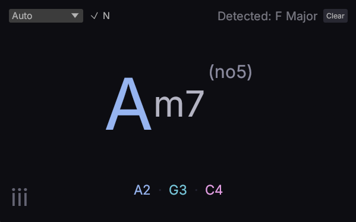

# ChordLens

**ChordLens** is a clean MIDI chord and scale detector for musicians and producers. It provides clear harmonic information in your DAW, helping you identify chords, track scale changes, and use Nashville numbering in real-time.

## Main Features

- **Chord Detection:** Quickly identifies chords from basic triads to complex jazz voicings (e.g., `Am7(b5)`, `Cmaj9`, `Fsus4`).
- **Scale Tracking:** Analyzes your performance history to suggest the most likely musical key. The engine is weighted towards recent notes for faster response to modulations, and it favors commonly known scales (Major/Minor) when multiple interpretations are possible.
- **Nashville Numbering:** Toggle the **[N]** button to see the chord's degree within the current scale (e.g., `IV`, `vi`, `V/ii`).
- **Visual Note Roles:** Notes are color-coded based on their role in the current scale—making root notes, scale steps, and chromatic "out-of-key" notes easy to spot.
- **Minimalist UI:** A focused interface designed for legibility at a distance, perfect for live playing or monitoring while recording.

## How it Works

- **Octave Handling:** Recognizes the core harmonic structure whether you're playing simple voicings or wide, octave-doubled spans.
- **Manual Key Lock:** You can manually set a root and scale mode (Major, Minor, Dorian, etc.) to override the auto-detection.
- **Inversions:** Displays 1st, 2nd, and 3rd inversions when detected.

## Installation

ChordLens is a **VST3** and **CLAP** plugin, compatible with most modern DAWs like Bitwig Studio, Ableton Live, Reaper, and FL Studio.

1. Download the plugin build.
2. Place the file in your VST3 or CLAP folder.
3. Refresh your plugin list and add **ChordLens** to any MIDI track.

## AI Assistance Disclaimer

This module is part of Schwung and was developed with AI assistance, including Claude, Codex, and other AI assistants.

All architecture, implementation, and release decisions are reviewed by human maintainers.
AI-assisted content may still contain errors, so please validate functionality, security, and license compatibility before production use.
