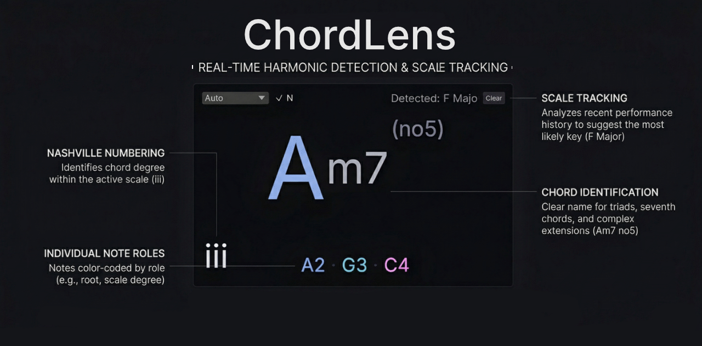

# ChordLens

ChordLens is a minimalist MIDI chord and key detector plugin for producers, songwriters, and musicians. It listens to incoming MIDI, identifies the current chord, estimates the active key, and can show Roman numeral scale degrees in real time.

## Features

- Real-time chord detection from simple triads to extended voicings
- Auto key tracking with manual key/mode override
- Roman numeral display relative to the detected scale
- Color-coded note display for quick harmonic context
- Optional chord history view for progression tracking
- VST3 and CLAP targets built from the same Rust codebase

## Installation

ChordLens is intended for modern DAWs that support MIDI-aware VST3 or CLAP plugins.

1. Download a [release for your platform](https://github.com/Fannon/ChordLens/releases).
2. Install the `ChordLens.vst3` and/or `ChordLens.clap` artifact into your normal plugin location.
3. Rescan plugins in your DAW.
4. Insert ChordLens on a MIDI-capable track and feed it MIDI input.

## Usage

- Leave the key on `Auto` to let ChordLens track tonal center from recent MIDI history.
- Switch the root away from `Auto` to lock the display to a specific root and mode.
- Toggle the history view to inspect the last stable chord changes.
- Use the `Roman Numerals`, `Root-less Voicings`, and `Key Tracking` parameters from your DAW when you want alternate harmonic heuristics or notation. The built-in editor currently exposes root, mode, reset, and history controls only.

## Development

Contributor-facing details live in [CONTRIBUTING.md](/C:/Development/chord-lens/CONTRIBUTING.md). Keep `README.md` and `CHANGELOG.md` user-focused.

The short version:

- Build distributable plugins with `cargo xtask bundle chord-lens --release`.
- Run `cargo test`, `cargo check`, and `cargo clippy --all-targets --all-features -- -D warnings` in your verify loop.
- Put scratch files, local bundles, captures, and release snapshots under `./tmp/`.
- Use [`AGENTS.md`](/C:/Development/chord-lens/AGENTS.md) for agent-specific guardrails.
